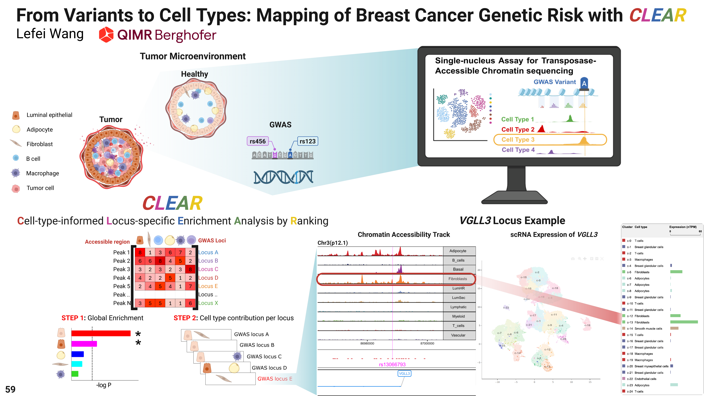
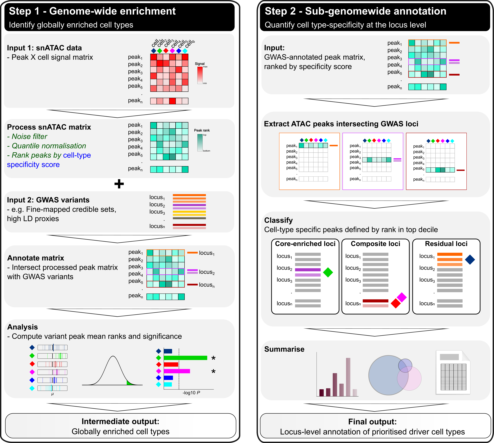

# CLEAR – Cell-type-informed Locus-specific Enrichment Analysis by Ranking

CLEAR is a framework for quantifying and ranking cell-type-specific regulatory contributions at individual GWAS risk loci by integrating fine-mapped variants with single-cell chromatin accessibility data. It provides locus-level, quantitative measures of cell-type involvement beyond global enrichment or single “risk-driving” cell type identification.

---

## Table of Contents

- [Overview](#overview)
- [Method Abstract](#method-abstract)
- [Input Data](#input-data)
- [ArchR Peak Signal Matrix Construction](#archr-peak-signal-matrix-construction)
- [Specificity Metrics](#specificity-metrics)
- [Enrichment Framework](#enrichment-framework)
- [Usage](#usage)
- [Project Structure](#project-structure)
- [Outputs](#outputs)

---

## Overview

Genome-wide association studies (GWAS) have been highly successful in identifying germline risk loci for complex traits, yet the majority of associated variants reside in non-coding regions and are believed to act through cell-type-specific regulatory mechanisms. Single-cell ATAC-seq (scATAC-seq) enables the construction of cell-type-specific (CTS) regulatory landscapes, providing an opportunity to map risk variants to regulatory elements in a cell-type-resolved manner.

Existing integrative methods combining GWAS with single-cell genomics, epigenomics, or spatial transcriptomics have primarily focused on identifying key risk-driving cell types at a genome-wide level, often recovering well-established cells of origin. However, these approaches generally lack quantitative measurements of cell-type contribution at individual loci and are not designed to highlight unexpected or secondary cell types of action. Such non-canonical cell-type effects, including immune or stromal contributions in solid tumors, may represent important but underexplored biological mechanisms and potential therapeutic targets.

CLEAR addresses this gap by providing a locus-level, quantitative framework that ranks cell-type specificity of regulatory elements overlapping fine-mapped GWAS variants. By comparing specificity ranks of variant-overlapping peaks against appropriate null models, CLEAR estimates how strongly each cell type contributes to regulatory activity at a given locus. The framework is modular, scalable, and applicable to diverse complex traits and single-cell regulatory datasets.

---

## Method Abstract

---

## Input Data

<!-- TODO: GWAS fine-mapped variants (~1500 traits from OpenTargets), scATAC-seq peak × cell-type matrices (ArchR processed) -->

- GWAS fine-mapped variants from [OpenTargets Genetics](https://platform.opentargets.org/)
- scATAC-seq peak × cell-type matrices generated using [ArchR](https://www.archrproject.com/)

### Data availability

The following table summarises the snATAC-seq datasets from the [Human-scATAC-Corpus](https://atlas.fredhutch.org/neftel/hscatac/) (Zhang 2021, ~0.9 million cCREs in 111 cell types from ~615k human adult cells) and other sources, along with matched GWAS traits and snRNA references.

#### snATAC-seq Datasets

| Tissue | Publication | # Donors | # Nuclei | # Cell Types | Platform | Disease Status | Notes |
| ------ | ----------- | -------- | -------- | ------------ | -------- | -------------- | ----- |
| Breast | [Zhang 2021](https://doi.org/10.1016/j.cell.2021.10.024) | 2 | 16,410 | 39 | sci-ATAC | Healthy | |
| Breast | Renger 2025 | 4 | - | - | 10X | Healthy and cancerous | |
| Pancreas | Zhang 2021 | 4 | 33,221 | 45 | sci-ATAC | Healthy | >50% acinar cells, fewer beta and alpha |
| Brain | Velmeshev 2023 | 16 | 39,268 | 7 | 10X | Fetal/Adult | |
| Brain | Corces 2025 | 8 | 70,631 | - | 10X | Cognitively Healthy | Donors aged >80 (one at 38); multiple brain regions; no fragments file |
| Heart | Kanemaru 2023 | 25 | 139,835 | 12 | 10X | Healthy | Multiome + SNP enrichment analysis |
| Blood | Lareau 2019 | 2 | 136,425 | 15 | dscATAC | - | Human bone marrow and PBMC |
| Skin | Zhang 2021 | 6 | 26,467 | 53 | sci-ATAC | Healthy | |
| Ovary | Jin 2025 | 8 | 41,550 | 7 | 10X | Healthy | 4 young + 4 reproductively aged donors |
| Colon | Zhang 2021 | 4 | 55,084 | 63 | sci-ATAC | Healthy | |
| Lung | Zhang 2021 | 4 | 19,552 | 40 | sci-ATAC | Healthy | |
| Kidney | Muto 2021 | 5 | 24,205 | 13 | 10X | Healthy | |
| Liver | Craig 2023 | 16 | 18,631 | 33 | 10X | Cancerous | HCC & iCCA (liver cancer subtypes) |

#### Matched GWAS Traits and Reference Atlases

| Tissue | Relevant Trait (OpenTargets) | # GWAS Loci | Known Cell Type Driver | snRNA Atlas | # Cell Types |
| ------ | ---------------------------- | ----------- | ---------------------- | ----------- | ------------ |
| Breast | Breast cancer | 210 | Luminal epithelial | Kumar 2021 | 10 |
| Pancreas | Pancreatic cancer | 23 | - | Schapiro 2025 | 18 |
| Pancreas | T1D | 114 | - | - | - |
| Pancreas | T2D | 951 | - | - | - |
| Brain | Alzheimer's | 454 | Microglia | Chen 2024 | - |
| Brain | Amyotrophic lateral sclerosis | 17 | - | - | - |
| Brain | Glioma | 17 | - | - | - |
| Brain | Parkinson's | 67 | - | - | - |
| Brain | Major depressive disorder | 94 | - | - | - |
| Heart | QRS duration | 63 | - | Kanemaru 2023 | 12 |
| Heart | QT interval | 161 | - | - | - |
| Heart | Systolic blood pressure | 1,162 | - | - | - |
| Heart | Atrial fibrillation | 306 | - | - | - |
| Heart | Hypertrophic cardiomyopathy | 236 | - | - | - |
| Blood | Multiple traits | - | - | Lareau 2019 | ~15 |
| Skin | Skin cancer | 99 | Keratinocytes | Zou 2021 / Almet 2023 | 11 |
| Ovary | Non-mucinous epithelial ovarian cancer | 27 | Epithelial | Jin 2025 | 7 |
| Colon | Colorectal cancer | 71 | Endothelial | Chu 2024 | 6 |
| Colon | Colon polyp | 46 | - | - | - |
| Lung | Lung cancer | 18 | Epithelial | Firsova 2025 | 35 |
| Kidney | Kidney cancer | 89 | - | Abedini 2024 | 15 |
| Kidney | Calculus of kidney | 94 | - | - | - |
| Liver | Hepatic cancer | 5 | - | - | - |

**Additional resources:**

- Cancer datasets (Tang 2025): scATAC + scRNA for breast, skin, colon, endometrium, lung, ovary, liver, and kidney
- Cell type markers from [CellMarker 2.0](http://bio-bigdata.hrbmu.edu.cn/CellMarker/) and PanglaoDB

---

## ArchR Peak Signal Matrix Construction

<!-- TODO: ArchR processing pipeline -->

- Summarised ArchR essential processing steps [ArchR processing](https://docs.google.com/document/d/12TJ8RZt97AsLWTHmqDecG8jwKzTnrnOjEpVfefXgW1M/edit?tab=t.0)

---

## Specificity Metrics

CLEAR computes multiple cell-type specificity metrics for each peak (regulatory element) across cell types. All metrics are computed after an initial **quantile normalisation (QN)** step to preserve empirical distributions across cell types (following CHEERS methodology).

### Preprocessing

**Quantile Normalisation (QN):**

$$M_{QN} = \text{quantile\_normalize}(M_{raw})$$

This ensures comparable distributions across cell types while preserving rank relationships.

### Primary Metrics

**1. L2 Norm (Euclidean Normalisation):**

For each peak $i$ across cell types:

$$L2_{i,j} = \frac{x_{i,j}}{\sqrt{\sum_{k=1}^{n} x_{i,k}^2}}$$

where $x_{i,j}$ is the QN-normalised signal for peak $i$ in cell type $j$. Returns zero vector if row sum is 0.

**2. Z-score Scaling:**

For each peak across cell types:

$$Z_{i,j} = \frac{x_{i,j} - \bar{x}_i}{\sigma_i}$$

**3. Log Transformation:**

$$\log_{i,j} = \log_2(M_{raw_{i,j}} + 1)$$

### Composite Scores

Composite metrics combine specificity (L2 norm) with magnitude (log-transformed raw signal):

**Composite 1 (Additive):**

$$Comp1_{i,j} = L2_{i,j} + \log_2(M_{raw_{i,j}} + 1)$$

**Composite 2 (Multiplicative):**

$$Comp2_{i,j} = L2_{i,j} \times \log_2(M_{raw_{i,j}} + 1)$$

### Tau Index

<!-- NOTE: Tau was evaluated but not used in final analysis -->

The Tau tissue specificity index measures how specific a peak is to particular cell types:

$$\tau_i = \frac{\sum_{j=1}^{n} \left(1 - \frac{x_{i,j}}{\max(x_i)}\right)}{n - 1}$$

where $n$ is the number of cell types. Values range from 0 (ubiquitous) to 1 (highly specific).

**Tau Composites:**

$$TauComp1_{i,j} = \tau_i + \log_2(M_{raw_{i,j}} + 1)$$

$$TauComp2_{i,j} = \tau_i \times \log_2(M_{raw_{i,j}} + 1)$$

### Ranking

All metrics are converted to ranks across cell types for each peak (rank 1 = lowest value, ties assigned minimum rank). The following ranked assays are computed:

| Metric | Ranked Version |
| ------ | -------------- |
| L2 Norm | `spec_rank` |
| Composite 1 | `comp1_rank` |
| Composite 2 | `comp2_rank` |
| Tau | `tau_rank` |
| Tau Composite 1 | `compsc1_tau_rank` |
| Tau Composite 2 | `compsc2_tau_rank` |

---

## Enrichment Framework

---

## Usage

---

## Project Structure

<!-- TODO: to be adapted from new CLEAR folder -->
<!-- TODO: scripts to be modularised and stored under /R -->

---

## Outputs

---
